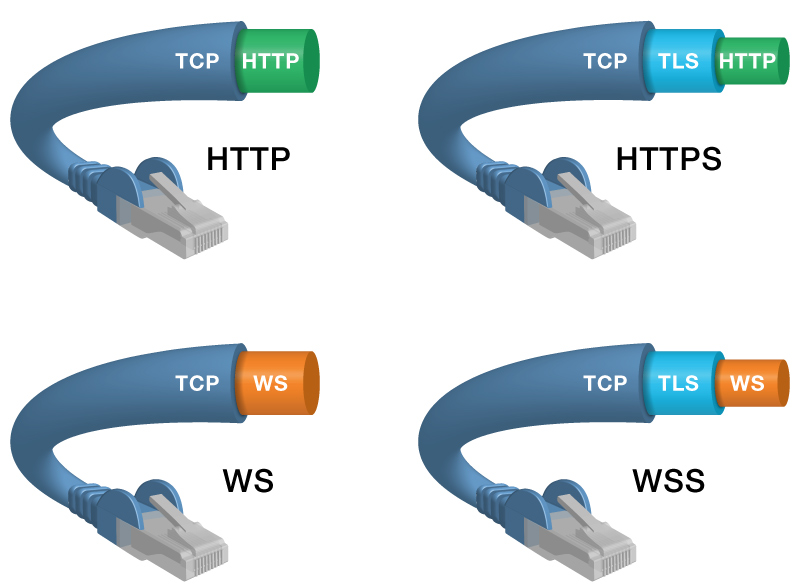

# WebSocket

Протокол WebSocket \(стандарт RFC 6455\) предназначен для решения любых задач и снятия ограничений обмена данными между браузером и сервером. Он позволяет пересылать любые данные, на любой домен, безопасно и почти без лишнего сетевого трафика.





### Рукопожатие между клиентом и сервером. 

Когда создаётся объект WebSocket, между клиентом и сервером выполняется рукопожатие, формирующее соединение WebSocket.
 IE10 начинает процесс рукопожатия с посылки HTTP-запроса на сервер:

Пьеса по распределению ролей при запросе соединения - что происходит в заголовке http запроса.

**Клиент -** заголовок со стороны клиента.

Процесс соединения начинается со стандартного запроса HTTP GET, что позволяет запросу проходить через сетевые экраны, прокси и другие промежуточные пункты. 

```text
GET /echo HTTP/1.1
Host: example.microsoft.com
```

HTTP-заголовок Upgrade является запросом к серверу на переключение протокола уровня приложения с HTTP на WebSocket.

```text
Upgrade: websocket
Connection: Upgrade
```

Сервер трансформирует значение заголовка Sec-WebSocket-Key при ответе, чтобы продемонстрировать, что он понимает протокол WebSocket:

```text
Sec-WebSocket-Key: dGhlIHNhbXBsZSBub25jZQ==
```

Заголовок Origin формируется IE10, чтобы позволить серверу применить политику безопасности, основанную на источнике.

```text
Origin: http://microsoft.com
```

Заголовок Sec-WebSocket-Version идентифицирует запрашиваемую версию протокола.

```text
Sec-WebSocket-Version: 13
```

**Сервер**

Если сервер принимает запрос на обновление протокола уровня приложения, он возвращает ответ HTTP 101 Switching Protocols:

```text
HTTP/1.1 101 Switching Protocols
Upgrade: websocket
Connection: Upgrade
```

Для демонстрации того, что он действительно понимает протокол WebSocket, сервер выполняет стандартизованное преобразование значения заголовка Sec-WebSocket-Key из клиентского запроса, и возвращает результат в заголовке Sec-WebSocket-Accept:

```text
Sec-WebSocket-Accept: s3pPLMBiTxaQ9kYGzzhZRbK+xOo=
```

**Снова Клиент**

	IE10 затем соотносит значение Sec-WebSocket-Key со значением Sec-WebSocket-Accept, чтобы гарантировать, что сервер действительно является сервером WebSocket, а не чем-то иным. Клиентское рукопожатие формирует соединение HTTP поверх TCP между IE10 и сервером. 

**Теперь Сервер**

	После того, как сервер возвращает ответ 101, протокол уровня приложения переключается с HTTP на WebSockets, который использует ранее установленное соединение TCP.

### Атрибут WebSocket.readyState

* CONNECTING - WebSocket только создан
* OPEN - соединение установлено успешно
* CLOSING
* CLOSED - соединение не удалось установить

### Шаблон создание соединения  WebSocket:

1\) **создание WebSocket**:

```text
var socket = new WebSocket("ws://адрес сервера"); // или wss://адрес сервера
```

2\) **Отсылка сообщения**. WebSocket позволяет пересылать любые запросы: бинарные, текстовые, файловые структуры.

```text
function sendTextMessage() {
		// проверка на установку соединения 
  		if (socket.readyState !== WebSocket.OPEN) {
    		return;
  		}
  	var e = document.getElementById("textmessage");
  	socket.send(e.value);
  	// пересылаем строку
  	socket.send(form.elements[0].file);
  	// или пересылаем файл
}
```

3\) **Подписки на события**. Вместо Promise технология использует создание подписок на все, что происходит:

3.1 Подписка на события установки соединения. Чтобы получать уведомления о том, что соединение было создано, приложение должно подписаться на события open.

```text
socket.onopen = function (openEvent) {
	  	document.getElementById("serverStatus").innerHTML = 'Web Socket State::' + 'OPEN';
};
```

3.2 Подписка на прием сообщения:

```text
socket.onmessage = function (messageEvent) {
	document.getElementById("textresponse").value = messageEvent.data;
}
```

3.3 Подписка на событие закрытия соединения.

```text
socket.onclose = function (closeEvent) {
    document.getElementById("serverStatus").innerHTML = 'Web Socket State::' + 'CLOSED';
};
```

3.4 Подписка на ошибку:

```text
socket.onerror = function(error) {
	alert("Ошибка " + error.message);
};
```

4\) **Закрытие соединения**. Подобно приветственному рукопожатию, есть также и прощальное рукопожатие. Любая из сторон \(приложение или сервер\) может инициировать этот процесс. Специальный тип фрейма \(закрывающий фрейм\) посылается другой стороне. Закрывающий фрейм может содержать опциональный код статуса и причину закрытия. Протокол определяет несколько соответствующих значений для кода статуса. Отправитель закрывающего фрейма обязан более не посылать никаких данных после закрывающего фрейма. Когда другая сторона получает закрывающий фрейм, она отвечает своим собственным закрывающим фреймом. Она может оправить предварительно несколько сообщений до закрывающего фрейма.

```text
socket.close(1000, "normal close");
```

где есть два параметра:

* код статуса из списка определённых в протоколе \(должен быть равен 1000 или другому числу из таблицы определения\)
* описание


